# FRA532 Lab Report

## Authors 
- Waritthon Kongnoo 65340500050
- Wasupol Hengsritawat 64340500049

To run the command provided in this repository, first clone this repository into your source folder of your ROS2 workspace, then run
```
cd {your_ros_workspace}
colcon build && source install/setup.bash
```

# Part 1: Kinematics of Mobile Robot
## Background Knowledge
### Drive Types
#### Basic Drive (Bicycle Model)
A fundamental method for controlling four-wheeled robots is the **bicycle model**, which approximates the robot as a two-wheeled system with one rear driving wheel and one front steering wheel. This simplified model controls the robot’s **linear velocity** $v_{Rx}$ and **angular velocity** $\omega_{Rz}$ using two key parameters:

 - Rear wheel velocity $v_{Wr}$
 - Front wheel steering angle $\delta$

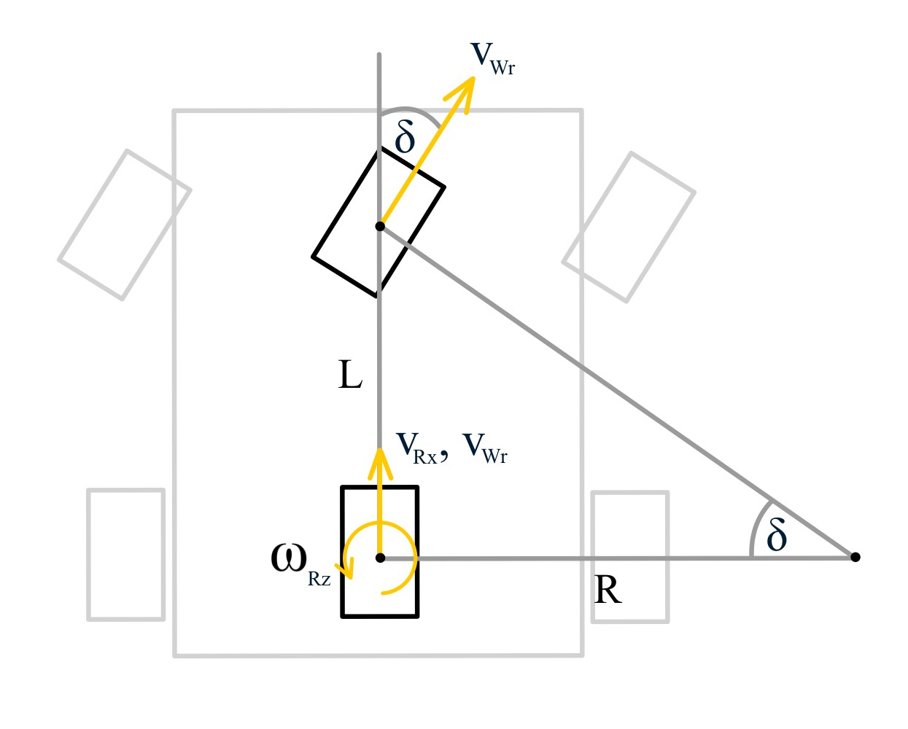

Given the desired robot linear and angular velocities, the steering angle $\delta$ can be computed using the following relation  $(1)$:

```math
\delta = \arctan{(\frac{\omega_{Rz}L}{v_{Rx}})}
```

where $L$ is the wheelbase—the distance between the front and rear axles. The angular velocity of the rear wheel is given by $(2)$:

```math
\omega_{Wr} = \frac{v_{Rx}}{r}
```

where $r$ is the radius of the wheel. The linear velocity of the front wheel can be expressed as:

```math
v_{Wf} = \frac{v_{Rx}}{\lvert{}v_{Rx}\rvert{}}\lvert{\omega_{Rz}} \rvert{} \sqrt{L^2+R^2}
```

This can be reformulated to compute the angular velocity of the front wheel as $(3)$:

```math
\omega_{Wf}=\frac{v_{Rx}}{r\lvert{}v_{Rx}\rvert{}} \sqrt{L^2\omega_{Rz}^2+v_{Rx}^2}
```

To apply the bicycle model to a four-wheeled mobile robot, the same steering angle $\delta$ is typically applied to both front wheels. However, this simplification leads to slippage, since the front wheels rotate around parallel axes and do not share a common instantaneous center of rotation. This misalignment causes lateral forces that can reduce motion accuracy, especially during tight turns.

#### Ackermann Drive

**Ackermann Drive** (or *Ackermann Steering Geometry*) is a steering mechanism commonly used in four-wheeled vehicles to ensure that all wheels follow circular paths **without slipping** during a turn.

Unlike differential or bicycle models, Ackermann steering more accurately reflects real car-like motion, where:

- Only the **front wheels** are used for steering
- Each front wheel is turned at a **different angle** during a turn:
  - $\delta_L$: steering angle of the front-left wheel
  - $\delta_R$: steering angle of the front-right wheel

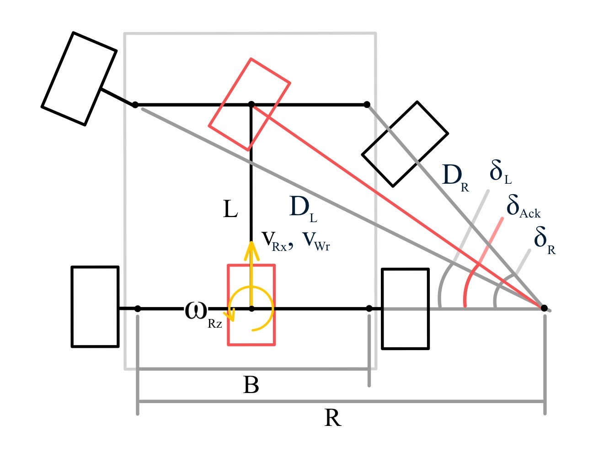

Given the desired robot linear and angular velocities, the **Ackermann steering angle** $\delta_{\text{Ack}}$ can be calculated using the same relation as in the bicycle model $(4)$:

```math
\delta_{\text{Ack}} = \arctan(\frac{\omega_{Rz}L}{v_{Rx}})
```

To maintain a common **instantaneous center of rotation**, the steering angles for the left and right front wheels are derived geometrically as $(5)$:

```math
\delta_L = \arctan( \frac{L \tan(\delta_{\text{Ack}})}{L + 0.5B \tan(\delta_{\text{Ack}})} ), \quad\delta_R = \arctan( \frac{L \tan(\delta_{\text{Ack}})}{L - 0.5B \tan(\delta_{\text{Ack}})} )
```


Given the actual steering angles of both front wheels, the **effective Ackermann steering angle** can be recovered using $(6)$:

```math
\delta_{\text{Ack}} = \arctan( \frac{2 \tan(\delta_L) \tan(\delta_R)}{\tan(\delta_L) + \tan(\delta_R)} )
```

The angular velocity of the rear wheel follows the same equation as in the bicycle model $(7)$:

```math
\omega_{Wr} = \frac{v_{Rx}}{r}
```

### Kinematic Models
#### Single-Track Model
The single-track model, also known as the bicycle model, simplifies a four-wheel vehicle by treating it as if it has a single front wheel and a single rear wheel aligned on a central axis—similar to a bicycle.

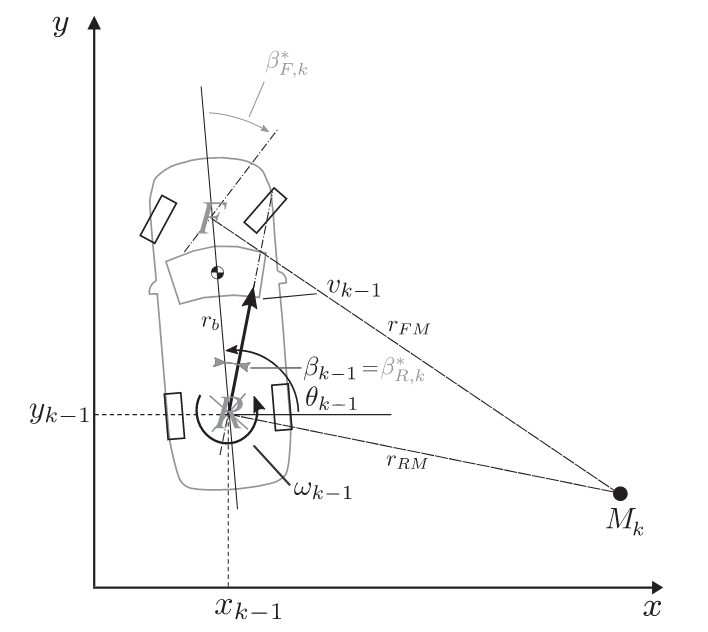

According to the figure and by applying the cosine law, we obtain:

```math
r^2_{FM} = r_b^2+r_{RM}^2-2r_br_{RM}\cos( \frac{\pi}{2} + \beta_R)
```

which leads to the non-trivial solution $(8)$:

```math
r_{RM} = r_b\cos( \frac{\pi}{2} + \beta_R)+r_{FM}\cos(\beta_F-\beta_R)
```

Next, applying the sine law:

```math
r_{FM}=\frac{\sin(\frac{\pi}{2}+\beta_R)}{\sin(\beta_F-\beta_R)}r_b
```

Using equation $(8)$, the expression simplifies to $(9)$:

```math
r_{FM}=\frac{r_b}{\cos\beta_R(\tan\beta_F-\tan\beta_R)}
```

Since the angular velocity is given by $v = \omega r_{RM}$​, and assuming $\beta_R=0$, the equation $(9)$ becomes $(10)$:

```math
\omega=\frac{v}{r_b}\tan{\beta_F}
```

The linear velocity of the vehicle is simple obtain by averaging the linear velocity of rear wheels which can be calculated using the angular velocity of each rear wheel $(11)$

```math
v=\frac{(\omega_{WrL}+\omega_{WrR})r}{2}
```

where $r$ is the wheel radius, and $\omega_{WrL}$ and $\omega_{WrR}$ are angular velocity of left and right rear wheels, respectively.

### Double-Track Model
The double-track model extends the single-track (bicycle) model by considering each of the four wheels (front-left, front-right, rear-left, rear-right) individually. This model captures the effect of separate wheel velocities, steering angles, and slip angles, providing a more accurate kinematic representation—especially during turning or dynamic maneuvers.

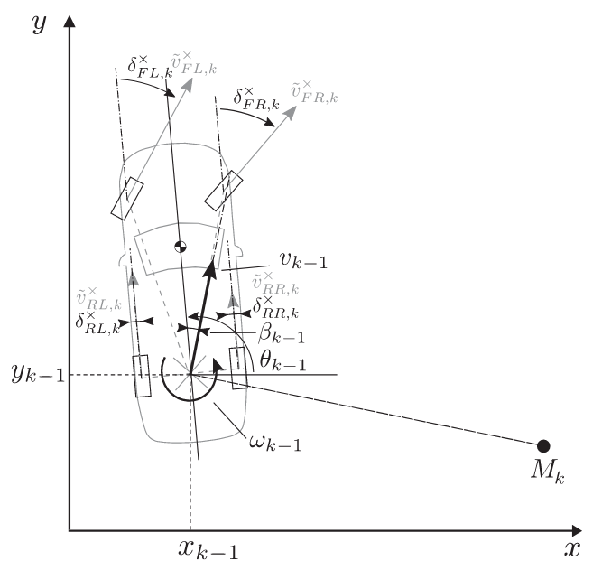

According to the figure, given the vehicle twist $[\vec{v},\vec{\omega}]^T$ and the position vector of each wheel contact point $\vec{r}_i$, the velocity at the contact point of each wheel $i$ is given by $(12)$:

```math
\begin{bmatrix}
        \bar{v}_{i,x}\\
        \bar{v}_{i,y}\\
        0
    \end{bmatrix} = 
    \begin{bmatrix}
        v\cos\beta\\
        v\sin\beta\\
        0
    \end{bmatrix} +
    \begin{bmatrix}
        0\\
        0\\
        \omega
    \end{bmatrix} \times
    \begin{bmatrix}
        r_{i,x}\\
        r_{i,y}\\
        0
    \end{bmatrix}
```

where $\beta$ is a slip angle. However, only the velocity component aligned with the actual wheel rolling direction—defined by the steering angle $\delta_i$—is relevant. Therefore, the effective rolling velocity at each wheel is $(13)$:

```math
\tilde{v}_i=\bar{v}_{i,x}\cos\delta_i+\bar{v}_{i,y}\sin\delta_i
```

Substituting Equation $(13)$ into $(12)$, we get $(14)$:

```math
\tilde{v}_i=v\cos(\delta_i-\beta)+\omega(r_{i,x}\sin\delta_i-r_{i,y}\cos\delta_i)
```

Given the angular velocity $\omega_i$, of each wheel, the linear velocity of that wheel can be approximated as $v_i=\omega_ir\approx\tilde{v}_i$ where $r$ is a wheel radius. Using the angular velocities and steering angles of the front wheels, the vehicle's angular velocity can be computed as $(15)$:

```math
\omega = \frac{v_1\cos(\delta_2-\beta)-v_2\cos(\delta_1-\beta)}
    {r_{1,x}\sin\delta_1\cos(\delta_2-\beta) - r_{1,y}\cos\delta_1\cos(\delta_2-\beta) - 
     r_{2,x}\sin\delta_2\cos(\delta_1-\beta) + r_{2,y}\cos\delta_2\cos(\delta_1-\beta)}
```

The vehicle's linear velocity can then be calculated as $(16)$:

```math
v = \frac{r_{1,x}v_2\sin\delta_1 - r_{1,y}v_2\cos\delta_1 - 
              r_{2,x}v_1\sin\delta_2 + r_{2,y}v_1\cos\delta_2}
    {r_{1,x}\sin\delta_1\cos(\delta_2-\beta) - r_{1,y}\cos\delta_1\cos(\delta_2-\beta) - 
     r_{2,x}\sin\delta_2\cos(\delta_1-\beta) + r_{2,y}\cos\delta_2\cos(\delta_1-\beta)}
```

**Note**: Since the double-track model considers the full state of all four wheels, the linear velocity can alternatively be approximated using the average wheel velocities, as described previously in Equation $(11)$.

### Yaw Rate
The yaw rate kinematic model refers to a formulation where the vehicle's yaw rate can either be directly computed (as in differential drive robots) or measured through onboard perception systems. This yaw rate information is then used for estimating the vehicle's pose and twist.

In this work, the yaw rate of the four-wheeled robot is obtained from an Inertial Measurement Unit (IMU), while the linear velocity is computed using Equation $(11)$.

## Experiments
### Objectives
1. To develop the system with bicycle model drive and Ackermann drive.
2. To develop the system with single track, double track, and yaw rate odometry methods which varied by kinematics models.
3. To compare the accuracy of robot position estimation using different odometry methods: single-track, double-track, and yaw-rate odometry.
4. To analyze the impact of different drive types—namely, basic drive and Ackermann drive—on the accuracy of robot pose estimation.
5. To identify the optimal combination of drive type and odometry method for accurate robot localization.

### Methodology

1. **Develop a mobile robot simulation** using **Gazebo**. The robot steering angle limit is 30 degrees (0.52 rad) for each front wheel.

2. **Implement a robot drive node** that converts robot twist commands (in the global frame) into individual wheel angular velocities based on the specified drive type:
   - **Basic drive**
   - **Ackermann drive**

   Then, verify the correctness and functionality of the developed node.
   The implementation of drive node is located in `limo_controller/scripts/controller/basic` for basic drive and `limo_controller/scripts/controller/ackermann` for Ackermann drive. Note that both kinematic classes are inherited from kinematic class in `limo_controller/scripts/kinematics.py`.

3. **Implement an odometry node** to estimate the robot's pose using joint state and IMU data, supporting the following odometry methods:
   - **Single-track**
   - **Double-track**
   - **Yaw-rate**

   The implementation of odometry node is located in `limo_controller/scripts/odometry.py`. Note that the kinematic class used in the code is located in `limo_controller/scripts/kinematics.py`.

4. **Run simulation experiments** for each robot drive type:
   - Set the **linear velocity** to **0.5 m/s**.
   - Vary the **angular velocity** for each run: −2.0, −1.0, −0.5, 0.0, 0.5, 1.0, and 2.0 rad/s.
   - For each run, record:
     - The **actual robot pose**
     - The **estimated pose** using each odometry method
     - The **robot joint states**

    Each run can be execute using the command:
    ```
    ros2 launch limo_controller limo_experiment type:={drive_type} v_x:={v_x} w_z:={w_z} time:={time}
    ```
    where `drive_type` can be either "basic" or "ackermann", `v_x` is the desired robot linear velocity, `w_z` is the desired robot angular velocity, and `time` is time in seconds to record experiment data. If `v_x` and `w_z` are both zero, the simulation will endlessly record the data in real-time which can be use with ROS2 teleop twist keyboard.

5. **Analyze and compare** the recorded results to evaluate the performance of each **drive–odometry combination**.

### Results
#### Basic Drive
Robot Positions (positions are record in meters)
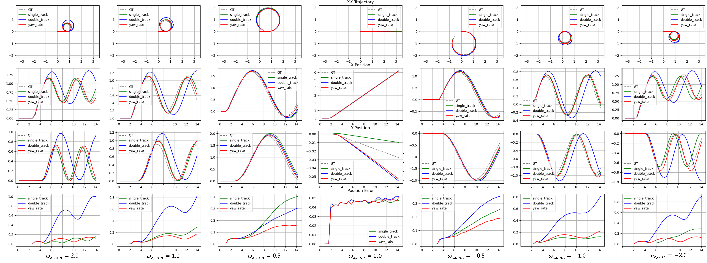
Robot Orientations (orientation are record in radians)
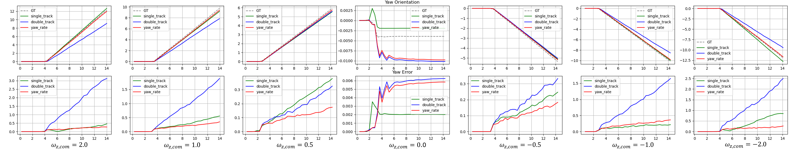
Robot Joint States (velocities are record in m/s)
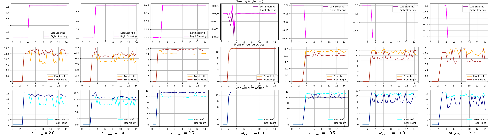

Based on the robot joint states and the resulting paths, the data confirm that the basic drive is correctly implemented. The steering angles of both front wheels are equal, as expected, and the robot follows a trajectory consistent with the given twist command. However, the recorded wheel angular velocities reveal noticeable noise spikes, which indicate **slippage**—a known issue in the bicycle model due to unaligned wheel axes. This slippage is caused by friction forces, especially during turns. Moreover, as the steering angle increases, the degree of slippage also increases, since the distance between the instantaneous centers of rotation of the two front wheels becomes larger.

The **double-track** odometry method demonstrated the **worst performance** among all evaluated methods. This result is expected, as double-track odometry relies on the angular velocities of both front wheels to estimate the robot’s pose. However, due to friction and slippage—particularly in high steering angle scenarios—the front wheel velocities are not reliable. In contrast, the **single-track** and **yaw-rate** odometry methods do not depend on the front wheel angular velocities, making them more robust under these conditions.

#### Ackermann Drive
Robot Positions
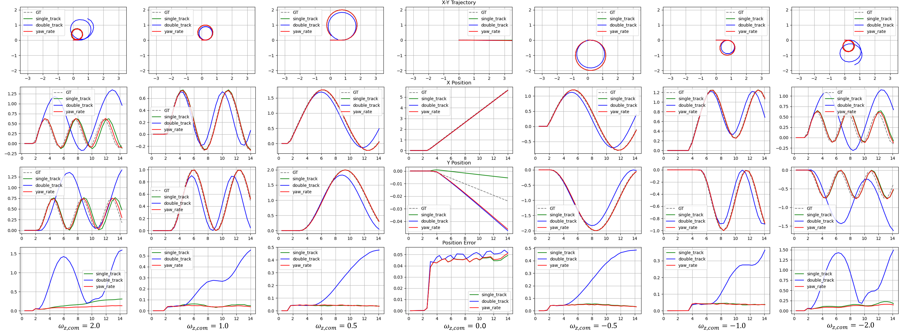
Robot Orientations
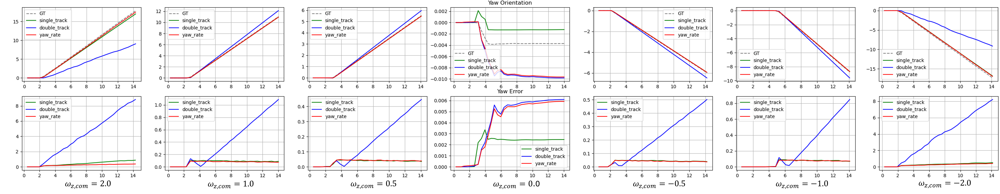
Robot Joint States
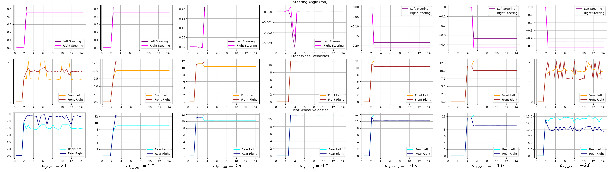

Compared to the basic drive that uses the bicycle model, the Ackermann drive results in less wheel friction, as evidenced by smoother wheel angular velocity profiles. However, noticeable spike noise appears in the wheel angular velocities when the desired robot angular velocity is −2.0 rad/s or 2.0 rad/s. These cases represent edge conditions, where one of the front wheel steering angles exceeds the predefined steering limit. As a result, the system violates Equation $(5)$, leading to the absence of a unique instantaneous center of rotation. This misalignment causes the robot to slip, introducing noise and instability into the motion.

The **double-track** odometry method continues to perform the **worst** even when using the Ackermann drive, despite the reduction in spike noise in the wheel angular velocities. A possible reason lies in the inherent nature of double-track odometry, which **heavily depends on front wheel velocities and steering angles**—both of which are susceptible to disturbances from friction between the wheels and the ground. Additionally, estimation errors in this method tend to accumulate over time, further reducing its reliability.

These observations suggest that even with Ackermann steering, **slippage cannot be fully eliminated**. Friction and the robot’s inertia—especially during turns—still introduce **centrifugal effects**, which contribute to deviations from the ideal path and reduce odometry accuracy.

#### Comparisons
Paths comparison between basic drive using bicycle model and ackermann drive
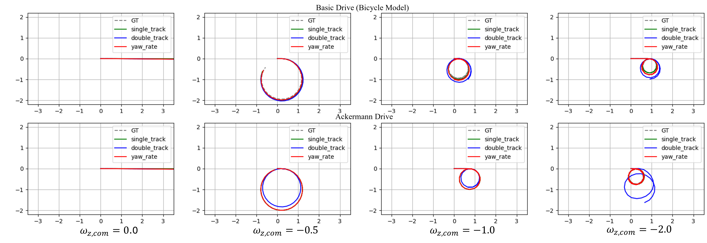
Positions comparison between basic drive using bicycle model and ackermann drive
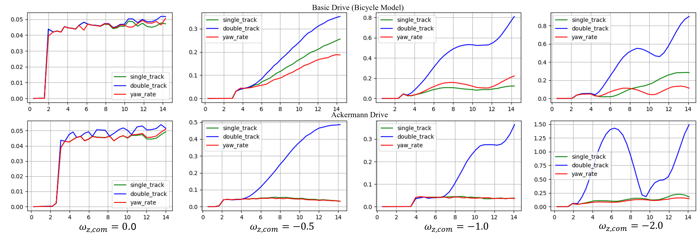
Orientations comparison between basic drive using bicycle model and ackermann drive
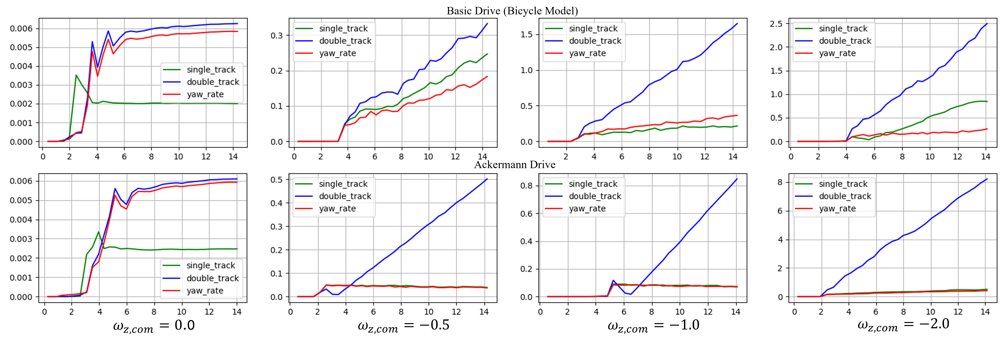
Overall, all odometry methods performed **better with the Ackermann drive** than with the basic drive. This is primarily because Ackermann steering provides **more reliable wheel velocity measurements**, while the basic drive suffers from increased slippage.

Interestingly, however, the double-track odometry method produced lower errors with the basic drive than with the Ackermann drive when the angular velocity command was −0.5 rad/s or 0.5 rad/s. This may be attributed to the simplicity of the bicycle model, which can be more effective at low angular velocities. In such cases, the simplified assumptions of the basic drive may lead to better performance, especially for methods like double-track odometry that heavily rely on accurate wheel velocities and steering angles. Thus, the limitations of the Ackermann model may become more pronounced in low-turn-rate scenarios.

### Conclusions
The symmetricity of the data between the positive robot angular velocity command and negative robot angular velocity command for both basic drive and Ackermann drive suggest that both drive nodes are correctly implemented. While the basic drive—based on the bicycle model—successfully produces the desired motion, it suffers from significant slippage due to equal steering angles on the front wheels and the lack of a shared instantaneous center of rotation. This slippage is reflected in noisy wheel angular velocities, especially at higher steering angles.

Among the three odometry methods evaluated, double-track odometry consistently performed the worst, regardless of the drive type. Its reliance on front wheel velocities and steering angles—both of which are sensitive to friction and slippage—makes it less robust than single-track and yaw-rate odometry, which performed more reliably by avoiding these dependencies.

Switching to the Ackermann drive reduces friction-related noise and improves overall odometry accuracy due to more realistic steering mechanics. However, extreme angular velocity commands (±2.0 rad/s) lead to steering saturation and violation of the geometric model, resulting in residual slippage and instability.

Interestingly, the double-track method performed slightly better under the basic drive for low angular velocities (±0.5 rad/s), likely due to the model’s simplicity and minimal steering distortion under these conditions. This highlights that, in low-turn-rate scenarios, the basic model can occasionally outperform more complex models due to its reduced susceptibility to geometric constraints.

**In summary**, Ackermann drive combined with single-track or yaw-rate odometry provides the most reliable performance for general cases, but the choice of odometry and drive model should consider expected motion characteristics—especially angular velocity—to balance complexity, reliability, and noise sensitivity.

# Part 2: Path Tracking Controller
## Background Knowledge
### Stanley Control
The stanley control is a nonlinear feedback control algorithm designed for using in the vehicle that can be modeled as a bicycle model. It focuses on reducing two types of error:

1. **Heading Error**: The difference between the vehicle's orientation and the desired path's heading direction.
2. **Cross-Track Error** (CTE): The lateral distance from the vehicle to the reference path.

Typically, the stanley controller operates in the constant linear velocity and adjust the steering angle as $(17)$:

```math
\delta = (\theta_p - \theta) +\arctan( \frac{ke}{v} )
```

where
- $\theta$: current vehicle heading
- $\theta_p$: heading of the path at the nearest point
- $e$: lateral cross-track error
- $v$: vehicle speed
- $k$: gain parameter

## Experiments 1
### Objectives
1. To implement the Pure Pursuit path tracking algorithm.
2. To study how the look-ahead distance ($l$) affects tracking performance.

### Methodology
1. Implement the Pure Pursuit controller to be fully compatible with the system developed in Part 1. The implementation is located at:
`limo_controller/scripts/path_tracking/path_tracking_pure_pursuit.py`
2. Execute the Pure Pursuit algorithm with various look-ahead distances: $l = 0.1, 0.25, 0.5, 0.75$ m. tThe robot—configured with Ackermann steering—is tasked with following the reference path defined in `limo_controller/config/path.yaml`. During each run, record:
    - The actual trajectory vs. the reference trajectory
    - The tracking error at each timestep
    - The twist command at each timestep

    Note: the linear velocity Kp is fixed at 1.50, and the angular velocity Kp is fixed at 3.0

    Launch the simulation using:
    ```
    ros2 launch limo_controller limo_drive.launch.py type:=ackermann
    ```
    Once initialized, start the path tracking:
    ```
    ros2 launch limo_controller limo_pathtrack.launch.py tracking:=pure_pursuit
    ```
3. Analyse the results.

### Results
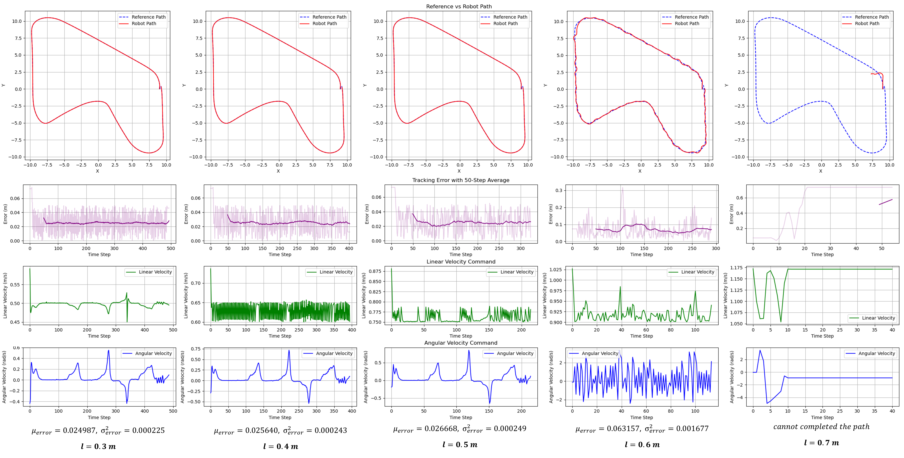
Increasing the look ahead distance results in faster tracking, required less time to completed the path, but also yields more tracking error especially in the sharp corner as can be seen in the path results from setting look ahead distance up to 0.6 m. Furthermore, since the path is almost smooth (the most sharp corner is not that sharp) the effect of the accuracy gained as the look ahead distance is decresed is only slightly observable. More interestingly, the angular velocity command of the pure pursuit with look ahead distance 0.3, 0.4, and 0.5 m also looks identical with only different in linear velocity command.

### Conclusion
Increasing the look-ahead distance results in faster path completion but introduces greater tracking error, particularly during sharp turns (e.g., at 0.6 m). However, given the overall smoothness of the path, reducing the look-ahead distance yields only marginal improvements in accuracy. Therefore, a look-ahead distance of 0.5 m is considered optimal for the Pure Pursuit controller, as it significantly reduces completion time without a substantial loss in tracking performance.

## Experiments 2
### Objectives
1. To implement the Stanley path tracking algorithm.
2. To investigate the effects of varying linear velocity ($v$) and control gain ($k$) on tracking performance.

### Methodology
1. Implement the Stanley controller to be fully compatible with the system developed in Part 1. The code is located at `limo_controller/scripts/path_tracking/path_tracking_stanley_control.py`

2. Run the Stanley algorithm with fixed gain $k=1.0$ and varying velocities $v=0.1,0.25,0.5,0.75$ m/s. Record:
    - The actual trajectory vs. the reference trajectory
    - The tracking error at each timestep
    - The twist command at each timestep

    Launch the simulation using:
    ```
    ros2 launch limo_controller limo_drive.launch.py type:=ackermann
    ```
    Once initialized, start the path tracking:
    ```
    ros2 launch limo_controller limo_pathtrack.launch.py tracking:=stanley_control
    ```

3. Analyze the results from Step 2 to identify the best-performing velocity.

3. Fix $v$ to the best-performing value from Step 2. , and run additional experiments with varying $k$ values: $k=0.5, 1.0, 2.5, 5.0, 7.5$.

4. Analyse the results.

### Results
#### Fixed $k$, vary $v$
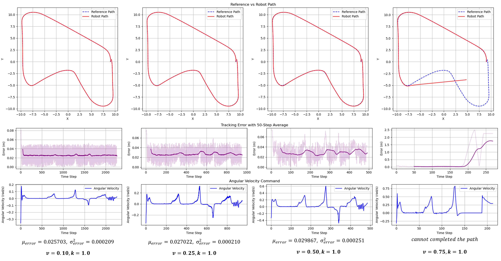
Increasing the linear velocity results in faster path tracking, similar to increasing the look-ahead distance in Pure Pursuit. However, it also significantly degrades tracking performance. This is because lower linear velocities allow the controller more time to reach each waypoint and make the arctangent term in Equation $(17)$ more responsive due to a smaller denominator.

The performance drop is not limited to sharp turns; it occurs in every corner. This is primarily because the robot is unable to decelerate dynamically at corners due to velocity constraints, leading to noticeable spikes in tracking error at each turn—especially at higher speeds.

As shown in the figure, the controller operating at 0.10 m/s achieves the lowest tracking error, but requires approximately five times longer to complete the path compared to the controller at 0.50 m/s, for only a 4 mm improvement in accuracy. Therefore, a linear velocity of **0.50 m/s** is selected for use in subsequent experiments, as it provides a practical balance between speed and accuracy.

#### Fixed $v$, vary $k$
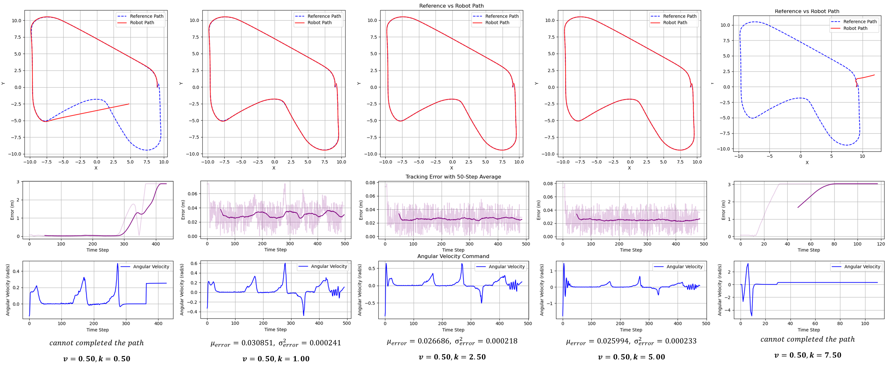
The figure illustrates that tuning the gain in the Stanley controller follows a similar pattern to tuning gains in other controllers, such as PID—only a specific range of gain values yields stable behavior and successful path completion.

Increasing the gain makes the cross-track error (CTE) term more sensitive, causing the robot to respond more aggressively in order to stay close to the reference path. This typically results in reduced tracking error without significantly affecting the completion time, unlike variations in linear velocity.

However, excessively high gain values lead to overly aggressive angular velocity commands (which directly influence the steering angle), resulting in oscillatory behavior and unstable angular velocity. This is evident in the figure for the case where k=7.2625,  where the robot exhibits oscillations. In extreme cases, the angular velocity can even diverge, as shown in the rightmost example in the figure above.

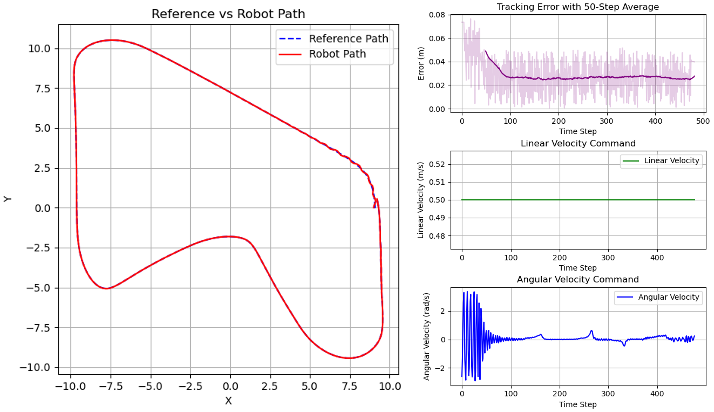

### Conclusions
Both linear velocity and controller gain significantly influence the performance of the Stanley controller in path tracking tasks. While increasing linear velocity shortens completion time, it also degrades tracking accuracy—particularly in corners where the robot cannot decelerate dynamically. A moderate velocity of 0.50 m/s offers an effective trade-off, reducing runtime while maintaining acceptable accuracy.

Similarly, gain tuning reveals that only a specific range yields stable and efficient behavior. Higher gain values improve responsiveness to cross-track error but can lead to instability and oscillations if too large. From the experiments, the optimal configuration is found to be $v=0.50$ m/s and $k=5.00$, since this setup achieves the fastest completion time with minimal tracking error and stable steering behavior, making it the preferred choice for further experimentation.

## Experiments 3
### Objectives
To compare the performance of Pure Pursuit, PID, and Stanley tracking controllers under the same test conditions.

### Methodology
1. Implement each path tracking controller to be fully compatible with the system developed in Part 1. The source code for each controller is located in: `limo_controller/scripts/path_tracking`. The hyperparameters of each controller are manually tuned to yield the most idealistic results (i.e. be able to complete the path smoothly with minimum error) as followed
    - **Pure Pursuit**: 
        - look ahead distance = 0.5 m
        - Linear velocity P Controller: Kp = 1.5
        - Angular velocity P Controller: Kp = 3.0
    - **PID**:
        - Linear velocity PID Controller: Kp = 5.0, Ki = 0.0, Kd = 0.5
        - Angular velocity P Controller: Kp = 2.5
    - **Stanley**
        - Linear velocity = 1.0 m/s
        - k = 5.0

2. Run each tracking algorithm to make the robot—configured with Ackermann steering—follow the reference path defined in `limo_controller/config/path.yaml`. During execution, record:
    - The robot's actual trajectory compared to the reference trajectory
    - The tracking error at each timestep

    The execution of each path tracking algorithm can be performed first using the command to launch the simulation:
    ```
    ros2 launch limo_controller limo_drive.launch.py type:=ackermann
    ```
    Once the simulation initializes successfully, start the path tracking node:
    ```
    ros2 launch limo_controller limo_pathtrack.launch.py tracking:={tracking_method}
    ```
    where `tracking_method` can be one of the following: "pure_pursuit", "pid", or "stanley_control"

3. Analyze and compare the performance of each method.

### Results
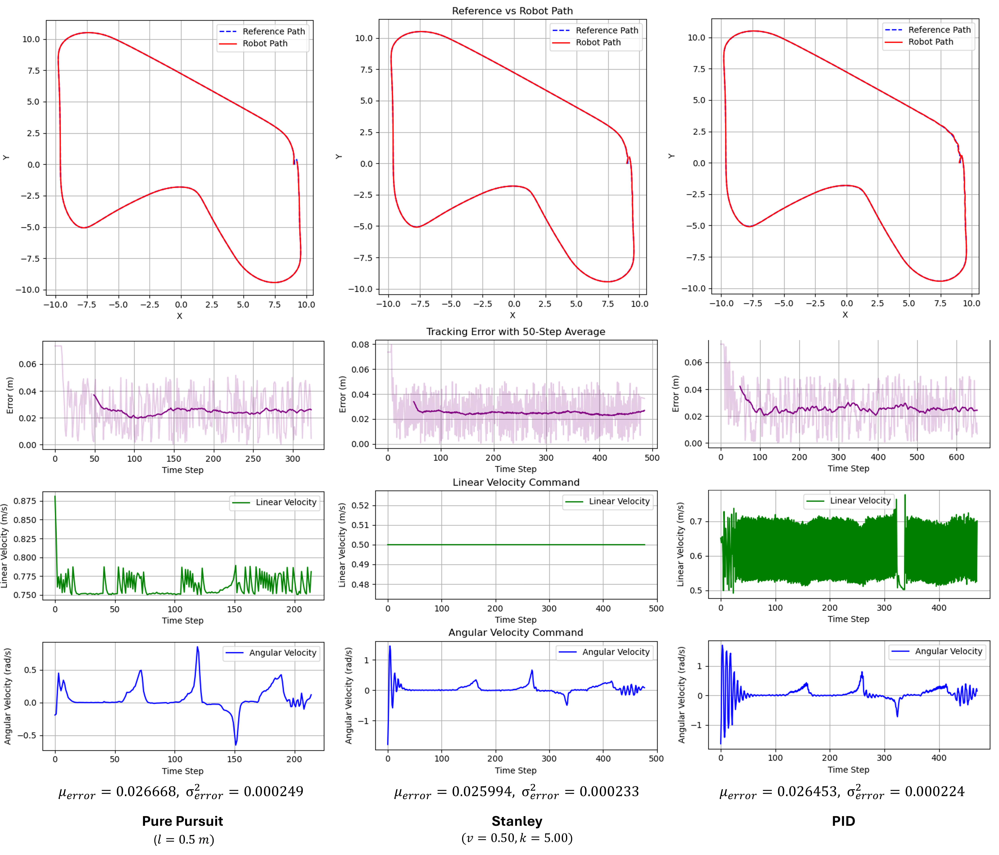

The Pure Pursuit, PID, and Stanley controllers are all capable of successfully tracking the given path, with similar tracking error distributions across all three. Each controller achieves a mean tracking error of approximately $\mu\approx2.6$ cm and the variance of $\sigma^2\approx0.00023$ cm2. 

However, the key differences lie in completion time and the nature of the twist commands generated by each controller.

The **Pure Pursuit controller** results in the fastest completion time. This is attributed to the simplicity of the path, which aligns well with the look-ahead strategy. As the controller targets a distant waypoint, heading errors are minimal, resulting in higher linear velocity commands and lower angular velocity commands.

The **Stanley controller** produces the simplest control behavior, as it primarily adjusts the angular velocity to correct for cross-track error. Despite its simplicity, it maintains acceptable tracking performance with relatively smooth commands.

In contrast, the **PID controller** exhibits the most variable twist commands, frequently adjusting both linear and angular velocities to compensate for tracking errors. This results in less stable control and the longest completion time among the three controllers.

### Conclusions
All three controllers—**Pure Pursuit**, **Stanley**, and **PID**—demonstrated effective path tracking with nearly identical tracking error distributions. However, their behaviors differ significantly in terms of completion time and command stability. These differences are summarized in the table below:

| Controller      | Completion Time | Command Stability         | Remarks                                                                 |
|----------------|------------------|----------------------------|-------------------------------------------------------------------------|
| **Pure Pursuit** | **Fastest**       | Smooth (low ω, high v)     | Benefits from path simplicity; low heading error due to look-ahead     |
| **Stanley**      | Moderate          | **Simplest** (varies only ω) | Adjusts angular velocity only; stable and acceptable performance       |
| **PID**          | **Slowest**        | **Most variable** (v and ω) | High compensation effort; results in unstable commands and long time   |

Based on the results, the **Pure Pursuit controller** offers the best performance for the given path due to its balance of speed and accuracy. However, the **Stanley controller** provides a good compromise with simple control logic and robust behavior. The **PID controller**, while functional, is less desirable for this task due to its instability and longer execution time.

# Part 3: Using EKF in Path Tracking
## Background Knowledge
The Extended Kalman Filter (EKF) applies the core principles of the standard Kalman Filter to handle nonlinear systems by performing linearization using the Jacobian matrix evaluated around the current state estimate. EKF operates in three main steps:

1. Prediction Step – Uses a motion model to predict the next state and its associated uncertainty.
2. Linearization – Computes the Jacobian of the nonlinear functions to facilitate the propagation of uncertainty through the system.
3. Update Step – Refines the state estimate using sensor measurements, incorporating both measurement deviation and weighting.

In this work, the EKF is implemented through the robot_localization package, which enables EKF-based estimation using the provided sensor data. The package allows flexible tuning of parameters through configurable settings, enabling effective sensor fusion and state estimation.

## Experiments 1
### Objectives
1. To implement ekf to compatible odometry from Part 1 to use in path tracking from Part 2.
2. To study how turning EKF parameter for use in case have more sensor and odometry data.

### Implementations
> [!Warning]
>  This part is incompleted due to lacking of the covariance tuning.

The experiments can be run by first running the simulation using the command:
```
ros2 launch limo_controller limo_drive.launch.py type:=ackermann pos_cov_s:={pos_cov_s} pos_cov_d:={pos_cov_d} pos_cov_y:={pos_cov_y} twist_cov_s:={twist_cov_s} twist_cov_d:={twist_cov_d} twist_cov_y:={twist_cov_y}
```

Where `pos_cov_s`, `pos_cov_d`, and `pos_cov_y` represent the pose covariance matrices obtained from the single-track, double-track, and yaw-rate odometry models, respectively. Similarly, `twist_cov_s`, `twist_cov_d`, and `twist_cov_y` represent the twist covariance matrices derived from the same respective models.

The latest covariance tuning are:
```
ros2 launch limo_controller limo_drive.launch.py type:=ackermann pose_cov_s:=0.2 pose_cov_d:=0.6 pose_cov_y:=0.1 twist_cov_s:=0.2 twist_cov_d:=0.6 twist_cov_y:=0.1
```

Then, run:
```
ros2 launch limo_controller limo_ekf_experiment.launch.py tracking:=pure_pursuit
```